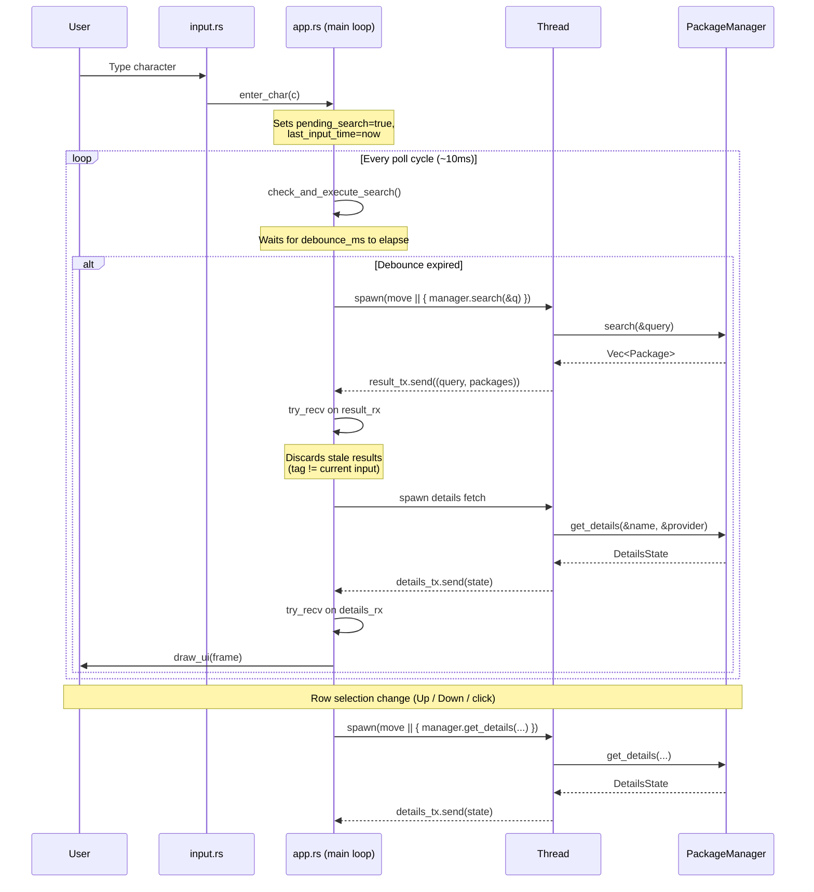

Thank you for your interest in contributing to **TRX**.
This document outlines the guidelines for contributing code, documentation, and ideas to the project.

---

# **1. Getting Started**

### **Clone the repository**

```bash
git clone https://github.com/pie-314/trx.git
cd trx
```

### **First-time setup (recommended)**

Run the setup script once after cloning. It registers the project's git hooks (`pre-commit` runs fmt + clippy; `pre-push` runs the full verify suite) and makes the helper scripts executable:

```bash
./scripts/setup.sh
```

Equivalent: `make setup`.

### **Build the project**

```bash
cargo build          # or: make build
```

### **Run the project**

```bash
cargo run            # or: make run
```

### **Run tests**

```bash
cargo test           # or: make test
```

Ensure the project builds without warnings before opening a pull request.

---

# **2. Project Structure**

```
src/
├── main.rs          # Application entry point & terminal setup
├── config.rs        # Configuration management
├── ui/              # Terminal UI components
│   ├── app.rs       # App state & event loop
│   ├── draw.rs      # Rendering logic
│   └── input.rs     # Input handling & debouncing
├── managers/        # Package manager backends (apt, brew, pacman, etc.)
└── fuzzy/           # Scoring-based fuzzy matching engine
```

---

# **2.5 Concurrency & Event Flow**

TRX uses **OS threads** and **`std::sync::mpsc` channels** for all background work. There is no async runtime — every blocking call (search, package details, update checks) runs on a dedicated thread spawned from the main event loop.

---

### **Main loop and thread lifecycle**

`main.rs` parses CLI flags first (`--version` / `--help` return immediately), then calls `color_eyre::install()`, initialises ratatui (alternate screen, raw mode, mouse capture), and creates a single `mpsc::channel::<(String, Vec<Package>)>` for search results:

```rust
let (result_tx, result_rx) = mpsc::channel();
let app_result = App::new(result_tx.clone(), result_rx).run(&mut terminal);
```

`App::new()` spawns a background update-check thread (if `config.settings.auto_update_check` is enabled), loads configuration, and selects the system package manager.

The core event loop in `App::run()` follows this pattern every iteration:

1. If on the **Search** tab, call `check_and_execute_search()` (debounce check).
2. Drain the `update_rx` channel for update-prompt responses.
3. Drain the `result_rx` channel for search/list results (discarding stale entries).
4. Drain the `details_rx` channel for package-detail responses.
5. Draw the UI frame via `terminal.draw(|frame| draw_ui(frame, &mut self))`.
6. Poll for keyboard input with a **10 ms timeout** (`event::poll(Duration::from_millis(10))`).

On exit, `App::run()` returns `Result<Option<String>>`. If the `Option` contains an update URL, `main.rs` calls `updater::update_self(&url)` outside the TUI.

---

### **Input event flow: `input.rs` → `app.rs`**

The `InputMode` enum in `input.rs` has two variants:

- **`Normal`** — Navigation, tab switching, action commands. Keypresses are matched against configurable keybindings from `config.keys` via the `is_key()` helper, which maps `KeyCode` values (e.g. `KeyCode::Char('q')`) to user-configurable string values (e.g. `keys.quit`).
- **`Editing`** — Search query or settings-field editing. Characters are inserted into `App.input` via `enter_char()`, which updates the string and sets two tracking fields:

```rust
self.last_input_time = Instant::now();
self.pending_search = true;
```

When the loop calls `check_and_execute_search()`, it checks whether `last_input_time.elapsed() >= Duration::from_millis(debounce_ms)`. If the debounce period has passed, a worker thread is spawned to execute the search.

---

### **Channel dispatch: search, details, and update checks**

Three `mpsc` channel pairs coordinate communication between the main loop and worker threads:

| Channel | Direction | Payload |
|---|---|---|
| `result_tx` / `result_rx` | Thread → Main | `(String, Vec<Package>)` |
| `details_tx` / `details_rx` | Thread → Main | `DetailsState` |
| `update_tx` / `update_rx` | Thread → Main | `Option<(String, String)>` |

**Search flow:** The main loop clones `Arc<Box<dyn PackageManager>>` and spawns a thread that calls `manager.search(&query)`. The thread sends the result tuple back on `result_tx`. The main loop drains `result_rx` with `try_recv()` and checks whether the string tag matches the current input — mismatched (stale) results from a previous query are silently discarded.

**Installed / Updates tabs:** The same `result_tx/rx` pair is reused with sentinel key strings:
- `"__INSTALLED__"` → results from `manager.get_installed_details()`
- `"__UPDATES__"` → results from `manager.get_updates()`

**Details flow:** When the selected row changes (arrow keys, Home/End, mouse click, or tab switch), `trigger_details_fetch()` spawns a thread that calls `manager.get_details(&pkg.name, &pkg.provider)` and sends a `DetailsState` enum ( `Empty` / `Loading` / `Success(...)` / `Error(...)` ) on `details_tx`.

**Update-check guard:** An `Arc<AtomicBool>` field (`update_check_in_flight`) prevents overlapping manual update checks. `trigger_manual_update_check()` uses `compare_exchange(false, true, ...)` to atomically claim the slot; if a check is already in flight the call is a no-op. The spawned thread releases the guard with `store(false, Ordering::Release)` after completion.

---

### **Package manager calls from worker threads**

The `PackageManager` trait requires `Send + Sync` so it can be shared across threads. The manager is stored as `Arc<Box<dyn PackageManager>>` in the `App` struct.

- **Read operations** (search, details, installed, updates) run **entirely on worker threads** — they may make blocking system calls, network requests, or subprocess invocations.
- **Write operations** (install, remove, update, system upgrade, refresh) are handled differently: they call `execute_external_command()` in `main.rs`, which **leaves the alternate screen**, runs the command via `std::process::Command`, prints the output, waits for the user to press Enter, and then restores the TUI.
- **`CombinedManager`** (when multiple backends are active) delegates to all enabled managers. For `update_packages` it smart-partitions the package set by intersecting with each backend's installed set, so backends only receive packages they own.

### **Sequence diagram**

The following diagram traces a complete search + auto-details cycle:



---

# **3. Contribution Areas**

You can contribute in any of these domains:

### **Backend Integrations**

Implement or improve package manager providers (apt, dnf, brew, winget, etc.).

### **TUI Improvements**

Optimizing rendering, new widgets, theme system, layout work.

### **Fuzzy Search Engine**

Improving scoring, heuristics, performance, or incremental updates.

### **Performance Work**

Caching, async pipelines, parallel execution.

### **Bug Fixes**

Reproduce, isolate, and fix issues.

### **Documentation**

Improve README, examples, architecture docs, or this file.

---

# **4. Coding Guidelines**

### **General**

* Keep the codebase clean and idiomatic.
* **Do not add useless or redundant comments** (especially AI-generated "noise").
* **Do not delete existing comments** unless they are factually incorrect or the code they describe has been removed.
* Prefer pure functions in UI components.
* Avoid blocking the UI thread with heavy I/O.
* Use **OS threads** and **mpsc channels** for background tasks (no async runtime).
* Return structured errors using `ManagerError`.

### **Style**

* Follow standard Rust formatting. The project ships with `rustfmt.toml` and `.clippy.toml` so everyone gets identical results.

Two helper scripts wrap the common workflow:

```bash
./scripts/fix.sh      # auto-format + auto-apply clippy fixes, then verify   (or: make fix)
./scripts/verify.sh   # fmt check + clippy + tests + build                   (or: make verify)
```

If you'd rather run the raw cargo commands:

```bash
cargo fmt --all
cargo clippy --workspace --all-targets --all-features -- -D warnings -A dead_code -A clippy::type_complexity
```

The two `-A` flags allow a small number of pre-existing patterns; everything else is treated as a hard error. If you add code that trips a *new* clippy lint, fix it rather than expanding the allow list.

If you ran `./scripts/setup.sh`, the `pre-commit` hook runs fmt + clippy automatically and the `pre-push` hook runs the full `verify` suite — so most of this happens for you.

### **Commits**

* Use clear, atomic commit messages following [Conventional Commits](https://www.conventionalcommits.org/en/v1.0.0/).
* Example:

  * `feat(pacman): async metadata caching`
  * `fix(ui): prevent double redraw on search`
  * `docs: update usage section`

---

# **5. Issues & Pull Requests**

### **Issues**

Before creating an issue:

* Check if the issue already exists.
* Use the provided **Issue Templates** to report bugs or request features.
* Include logs, platform, and version when relevant.

### **Claiming an Issue**

If you want to work on an existing issue:

1. **Comment on the issue** expressing your interest.
2. **Describe how you plan to solve it.**
3. **Show screenshots/recordings** if the proposed change is visual or UI-related.
4. A maintainer will then assign the issue to you.

**Important Rules:**
* **Atomic PRs:** One PR should solve exactly one issue. Do not combine multiple unrelated fixes or features.
* **No Unrelated Changes:** Do not modify, reformat, or delete code in files unrelated to your assigned task. Check your `git diff` before committing.
* **Draft PRs:** If you want early feedback or aren't finished yet, open a **Draft Pull Request**.

### **Pull Requests**

1. Fork the repository
2. Create a feature branch (target the `dev` branch)

   ```bash
   git checkout dev
   git checkout -b feature/my-improvement
   ```
3. Make your changes
4. Run tests + lint
5. Commit and push
6. Open a PR **against the `dev` branch** describing:

   * what changed
   * why
   * how it was tested
   * **screenshots or recordings** (if the change affects the UI)

PRs should not include unrelated formatting changes.

---

# **6. Adding a New Package Manager Backend**

To add a new provider, implement the trait:

```rust
pub trait PackageManager: Send + Sync {
    fn name(&self) -> &str;
    fn search(&self, query: &str) -> Vec<Package>;
    fn get_installed(&self) -> HashSet<String>;
    fn get_installed_details(&self) -> Vec<Package>;
    fn get_updates(&self) -> Vec<Package>;
    fn get_details(&self, pkg: &str, provider: &str) -> Option<HashMap<String, String>>;
    fn install(&self, terminal: &mut DefaultTerminal, pkgs: &HashSet<String>) -> Result<(), Box<dyn std::error::Error>>;
    fn remove(&self, terminal: &mut DefaultTerminal, pkgs: &HashSet<String>) -> Result<(), Box<dyn std::error::Error>>;
    fn system_upgrade(&self, terminal: &mut DefaultTerminal) -> Result<(), Box<dyn std::error::Error>>;
    fn refresh_databases(&self, terminal: &mut DefaultTerminal) -> Result<(), Box<dyn std::error::Error>>;
}
```

Refer to existing backends (pacman/yay) for structure and system-call patterns.

---

# **7. Development Environment**

Recommended tools:

* Rust 1.70+
* Clippy (`rustup component add clippy`)
* Rustfmt (`rustup component add rustfmt`)
* A terminal supporting Unicode + truecolor
* `make` (used by the project's task runner)

Project task runner (`Makefile`):

| Target         | What it does                                            |
| -------------- | ------------------------------------------------------- |
| `make setup`   | Install git hooks and make scripts executable           |
| `make run`     | Run the TUI                                             |
| `make build`   | Build all targets with all features                     |
| `make test`    | Run the test suite                                      |
| `make fix`     | Auto-format and auto-apply clippy fixes, then verify    |
| `make verify`  | Full check: fmt + clippy + tests + build (what CI runs) |
| `make fmt`     | `cargo fmt --all`                                       |
| `make lint`    | `cargo clippy` with the project lint config             |
| `make clean`   | `cargo clean`                                           |

Continuous integration (`.github/workflows/ci.yml`) runs `make verify` plus `cargo audit` on every PR and push to `main`. Running `make verify` locally before pushing keeps the CI feedback loop short.

Optional tools:

* `cargo-expand` for macro debugging
* `cargo-audit` for security audits (CI runs this; install locally with `cargo install cargo-audit --locked` if you want to check before pushing)
* `cargo-insta` for snapshot testing (planned)

---

# **8. Code of Conduct**

All discussions and contributions must follow respectful, constructive communication.
Harassment, discrimination, or hostile behavior is not tolerated.

---

# **9. Questions / Discussions**

Use **GitHub Issues** or **Discussions** for:

* feature proposals
* design debates
* questions about architecture
* help with contributing

---

# **10. Thank You**

Your contributions make TRX better.
Even small improvements—typos, refactors, documentation—are highly valued.

