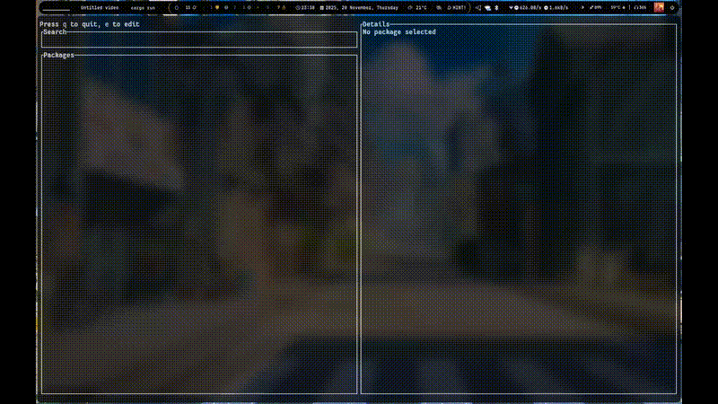

# **TRX – Terminal User Interface Package Manager**

TRX is a TUI-based, multi-backend package manager implemented in Rust. It provides a unified abstraction layer over system package managers and exposes a high-performance, event-driven terminal interface for search, inspection, and package operations.

---



---

## Overview

TRX consists of three core layers:

1. **Frontend (TUI Layer)** — Rendering, input handling, event scheduling  
2. **Core Engine** — State management, command routing, async orchestration  
3. **Backend Managers** — Adapters for different package managers (pacman, yay, apt, etc.)

Each backend implements a common trait allowing TRX to issue abstract actions (install, remove, search) independent of the underlying package system.

---

## Features

* Renderer built on `ratatui` with deterministic layout and minimal redraw overhead  
* Fully non-blocking event loop using `tokio`  
* Unified command model for package managers with pluggable backend architecture  
* In-built fuzzy matcher optimized for substring scoring and ranking  
* Stateless backend operations executed via system calls with structured output parsing  
* Extensible design suitable for adding new package managers without modifying the core engine  

---

## Installation

```bash
git clone https://github.com/pie-314/trx.git
cd trx
cargo build --release
sudo cp target/release/trx /usr/local/bin/
```

Requirements:

* Rust 1.70+  
* Terminal supporting Unicode and truecolor  

---

## Usage

```bash
trx
```

### Navigation Keys

| Key            | Action         |
| -------------- | -------------- |
| ↑ / ↓ or j / k | Navigate list  |
| Enter          | Confirm action |
| q              | Quit           |
| e              | Search field   |
| ?              | Help (not implemented) |

### Operations

| Key | Action                |
| --- | --------------------- |
| i   | Install package       |
| r   | Remove package (not implemented) |
| u   | Update package (not implemented) |

---

## Architecture

```
src/
├── main.rs           # Runtime initialization
├── app.rs            # Global app state + reducer
├── ui/               # TUI components, widgets, layout
├── managers/         # Package manager backends (currently mod.rs has everything)
│   ├── pacman.rs
│   ├── yay.rs
│   ├── apt.rs (planned)
│   └── traits.rs     # Manager abstraction
└── fuzzy/            # Search engine + scoring
```

### Core Components

#### 1. **Event Loop**

* Polls keyboard input via `crossterm`  
* Schedules redraws only when state mutations occur  
* Executes asynchronous backend tasks using `tokio::spawn`  

#### 2. **Backend Abstraction**

```rust
pub trait PackageManager {
    fn search(&self, query: &str) -> Result<Vec<Package>, ManagerError>;
    fn install(&self, pkg: &str) -> Result<(), ManagerError>;
    fn remove(&self, pkg: &str) -> Result<(), ManagerError>;
    fn update(&self, pkg: &str) -> Result<(), ManagerError>;
    fn info(&self, pkg: &str) -> Result<PackageInfo, ManagerError>;
}
```

#### 3. **Fuzzy Engine**

* Character-index based scoring  
* Distance and span penalty  
* Consecutive-match boost  
* Case-insensitive normalization  

---

## Supported Package Managers

### Implemented

* pacman  
* yay  

### In Progress / Planned

* apt  
* dnf / yum  
* zypper  
* Homebrew  
* winget, scoop, chocolatey  
* BSD pkg  

---

## Development

### Build

```bash
cargo build
```

### Run

```bash
cargo run
```

### Test

```bash
cargo test
```

### Coding Standards

* No blocking I/O inside the TUI thread  
* All backend calls isolated and spawned asynchronously  
* Error pathways must return structured errors (`ManagerError`)  
* UI must be pure/render-only; no side effects in widgets  
* State transitions handled only via centralized reducer  

---

## Roadmap

* Generic dependency graph resolver  
* Transaction history and rollback  
* Batch mode for scripting  
* Pluggable themes and renderer settings  
* Improved scoring heuristics for fuzzy matching  
* Cross-platform installation support via binary releases  
* Expanded backend support (apt, dnf, zypper, brew, winget, scoop, pkg)  
* Faster TUI rendering with diff-based updates  
* Parallel execution for searches and batch operations  
* Metadata caching for faster searches and info lookups  
* Unified error handling and diagnostics  
* Plugin system for custom backends, widgets, and themes  
* Async log and event streaming inside the TUI  
* Incremental fuzzy search for low-latency typing  
* Configurable keybindings via config file  
* Optimized virtual scrolling for large package lists  
* Built-in benchmarking tools (UI, fuzzy, backend performance)  
* Semantic version comparison and upgrade advisories  
* Persistent state across sessions  
* Isolated/sandboxed backend command execution  

---

## License

Licensed under the MIT License.  
See `LICENSE` for details.


We are actively looking for contributors.
If you're interested in Rust, terminal UIs, package managers, or async design — feel free to pick an issue or open a discussion. Beginners welcome.
